#### Copyrights

Copyright (C) 2013 T Dispatch Ltd

    T Dispatch Ltd
    35 Paul Street
    London
    UK EC2A 4UQ

For more details visit www.tdispatch.com

#### Trademarks

T Dispatch logo, T Dispatch, the T Dispatch T shaped logo are all trademarks of T Dispatch Ltd.

#### Building

Build requirements
 - At least basic knowledge on iOS development
 - XCode 5
 - GoogleMaps iOS SDK 7 (https://developers.google.com/maps/documentation/ios/start)

To make the app work you need to collect couple of keys and tokens for various APIs application is using.
Mandatory are T Dispatch APIs (Fleet API and Passenger API) and Google Maps iOS API.

 - Download Google Maps iOS SDK. Unzip the archive and rename unpacked directory to GoogleMaps-iOS. Copy the directory
   to the same dir Passenger.xcodeproject is located. The structure should look like this:
    CHANGES.txt
    LICENSE.txt
    Passenger
    Passenger.xcodeproj
    TestFlightSDK
    screenshots
    GoogleMaps-iOS
    README.md
 - Open Passenger project in XCode.
 - Change name of the application and bundle id in [Passenger-Info.plist](Passenger/Passenger-Info.plist) file. The common pattern for bundle id is to use
   domain name here. For example if the cab office uses `cabofficename.com` domain, then your pakcage name should be
   `com.cabofficename.passenger`.

 - Getting T Dispatch Fleet API key:
   - Log in to your T Dispatch cab office account (you need to have office manager rights)
   - Go to `Preferences` view, then `Settings` there and then `Fleet API`
   - Copy your "API key" form there and store in [NetworkEngine.m](Passenger/NetworkEngine.m) as FLEET_API_KEY
   - Contact support (@) tdispatch.com to get your ClientId and ClientSecret tokens for your app and put in
     [NetworkEngine.m](Passenger/NetworkEngine.m) as PASSENGER_CLIENT_ID and PASSENGER_CLIENT_SECRET once you get it.
   - **IMPORTANT** your application have to be **granted** access to particular cab office **before** you release the app. To do so,
     you need to access the API from your app using your Fleet API key and Client/Secret pair. The simplest approach is to just
     build the app and then click `Sign in` (you do not need an account). That will make required API call and your app will be
     listed as one that is willing to access given cab office. Then the cab office manager has to go to his T Dispatch console,
     to `Preferences` ->  `Settings` -> `Fleet API` and click `Approve` next to your application name. From now on, you app can
     act on behalf of that cab office unless your access gets revoked manually by cab office managers.

 - Now we need to enable Google Maps API for our app. Go to Google Api Console: https://code.google.com/apis/console/
   then switch to `Services` pane, look for `Google Maps SDK for iOS` and enable it. Now go to `API Access` pane and create
   Google Maps API key for your app, by clicking `Create new iOS key...`. Now you need to enter bundle id of your app and
   accept. As a result you get your own API key (which looks like `AIzaTxknt93Lxj3J8ao5yhvcYjxxTjpa2bh742`) which should be put
   in [AppDelegate.m](Passenger/AppDelegate.m) as a parameter in a call to [GMSServices provideAPIKey:@""].

 - Tweak app settings by editing [CabOfficeSettings.plist](Passenger/CabOfficeSettings.plist) file:
    - Set proper default fallback location so it points to geographically correct location.
    - Disable demo warning by setting `caboffice_settings_hide_demo_warning` to `false`

 - Change application icon and cab office logo.
    - Replace cab_office.png and cab_office@2x.png logos in [gfx](Passenger/gfx/) folder. We suggest you keep it no bigger than
      `300p x 300p`.
    - Replace icons (icon.png, icon@2x.png, icon_72.png and icon_144.png) in [gfx](Passenger/gfx/) folder.

 - Optionally you can set TestFlight token in [AppDelegate.m](Passenger/AppDelegate.m) if you intend to provide beta releases
   via TestFlight.

 - Build.

#### Translators

 - English: Marcin Orłowski
 - Deutsch (German): Adrian Doonan
 - Español (Spanish): Xavier Blanche
 - Français (French): baltmayer
 - Malay (Malay): JC Way Translation Inc.
 - Polski (Polish): Marcin Orłowski
 - Português do Brasil (Brazilian Portuguese): Mario Brandão, Bernardo Heynemann
 - Svenska (Swedish): strix
 - Українска (Ukrainian): Eugeny Perepelkov
 - русский (Russian): Eugeny Perepelkov
 - Italiano (Italian): Sonia Maccarone
 - 한국어 (Korean): JC Way Translation Inc.
 - ภาษาไทย (Thai): JC Way Translation Inc.
 - 繁體字 (Traditional Chinese): Julie Ko
 - 簡體字 (Simplified Chinese): Julie Ko
 - 日本語 (Japansese): JC Way Translation Inc.

Thank you for your contribution!

#### License

    Licensed under the GPL License, Version 3.0 (the "License");
    you may not use this file except in compliance with the License.
    You may obtain a copy of the License at

        http://www.gnu.org/licenses/gpl-3.0.html

    Unless required by applicable law or agreed to in writing, software
    distributed under the License is distributed on an "AS IS" BASIS,
    WITHOUT WARRANTIES OR CONDITIONS OF ANY KIND, either express or implied.
    See the License for the specific language governing permissions and
    limitations under the License.

#### Open Source licenses

This application uses the following third party components:

 - CBAutoScrollLabel by Brian Stormont
 - SVPullToRefresh by Sam Vermette
 - MKNetworkEngine by Mugunth Kumar
 - PKRevealController by Philip Kluz
 - AGWindowView by Håvard Fossli
 - libCocolize by Tall Developments
 - DAPagesContainer by Daria Kopaliani

#### Screenshots phones

 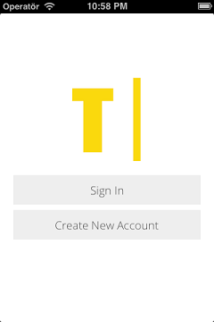
 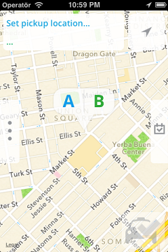
 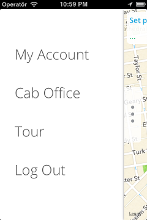
 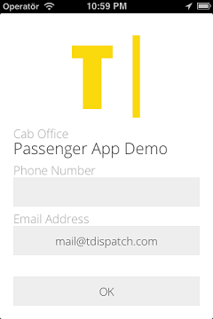
 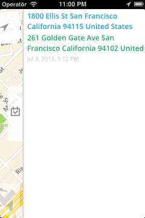
 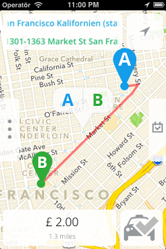
 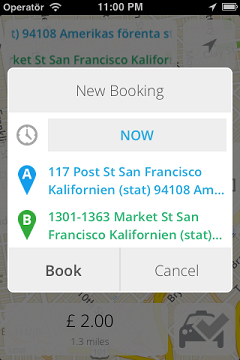
 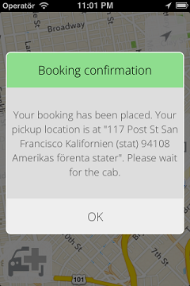
 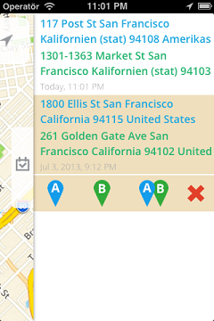

#### Screenshots tablets

 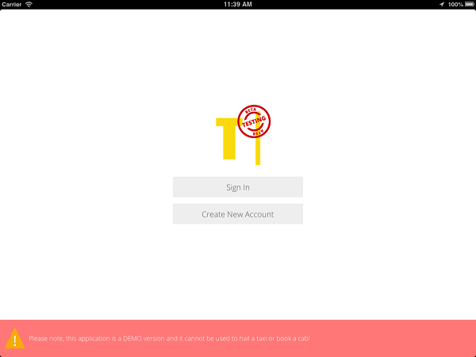
 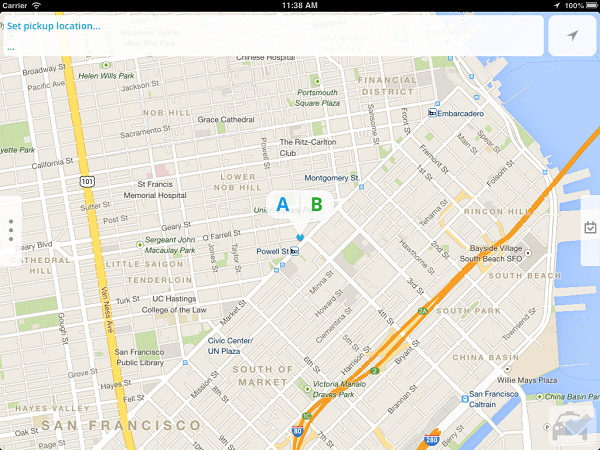
 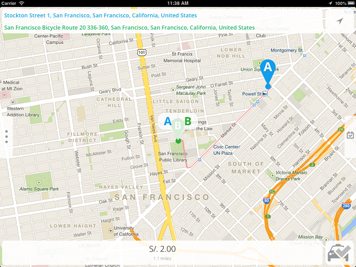
 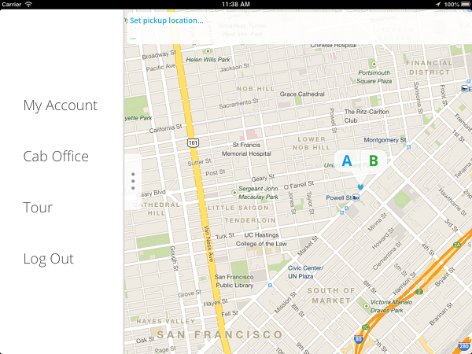
 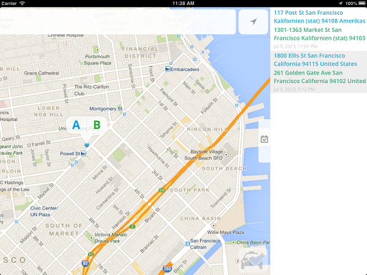
 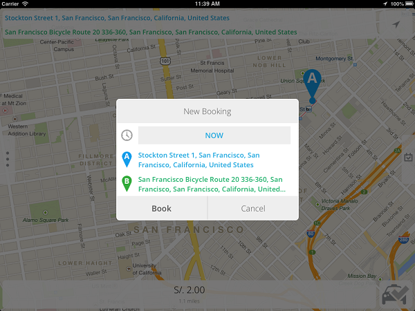

